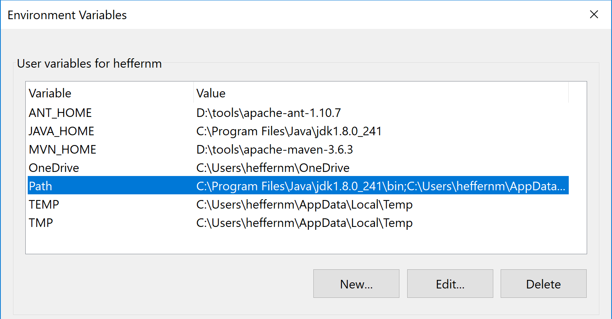
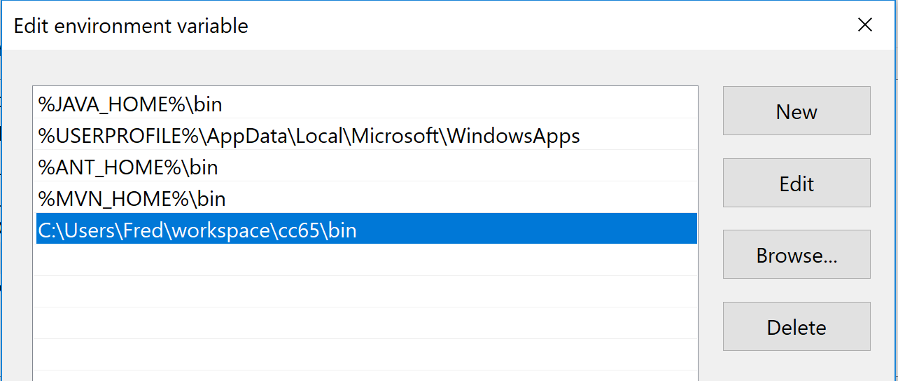

# x16-assembly-tutorial
A tutorial for learning 65C02 Assembly Language using the Commander X16.

This is a repo containing all the materials from my YouTube series. Available
now are the following lessons:

- Lesson 1: The Basics [2nd Edition now available!]
- Lesson 2: Addressing Modes [2nd Edition now available!]
- Lesson 3: Branching and Subroutines
- Lesson 4: Arithmetic and Logic
- Lesson 5: The Stack
- Lesson 6: A Bit Advanced
- Lesson 7: The Rest
- Lesson 8: Meet the Kernal
- Lesson 9: Hello, VERA!
- Lesson 10: Interrupts
- Lesson 11: Advanced Math
- Lesson 12: Tiles
- Lesson 13: PSG Sound
- Lesson 14: Mouse and Joysticks
- Lesson 15: Bitmaps
- Lesson 16: All in the Timing
- Lesson 17: FM Synthesis
- Lesson 18: Sprites

More to come!

Each lesson has its own directory here. Please feel free to do what you want
with these code examples - it is all [free and open source](LICENSE).

# Building with Windows (Cygwin)

The build toolchain for this project requires a GNU environment, which is
natively available on most Linux and Unix (include Mac) platforms. For
Windows, I would strongly recommend using the Windows Subsystem for Linux (WSL) and following
the instruction below for Linux, but if you don't have that, you will need a program
called Cygwin that will provide a GNU
userspace in Windows that will give you a Unix-like environment for development.

## Installing and Configuring Cygwin

First, you will need to download the Cygwin setup program from here:
https://cygwin.com/setup-x86_64.exe

When you run the program, it will ask you which packages you want to install.
Make sure the following packages are selected:

- git
- gcc-core
- make

Then, when Cygwin is installed, open the Cygwin Terminal program (you can
specify to have a shortcut put on your desktop during the install) and cd
to whatever directory you want to maintain your workspace. In Cygwin, the
drive letters are also second-level directories, so your C drive is /cygdrive/c/
and your D drive is /cygdrive/d/, etc. If my Windows username is **Fred** and
I want to put a "workspace" directory in my profile alongside my "Documents"
directory, I can do the following:

```
$ cd /cygdrive/c/Users/Fred
$ mkdir workspace
$ cd workspace
```

There, you can use git to clone this repository with the following command:

```
$ git clone https://github.com/SlithyMatt/x16-assembly-tutorial.git
```

You will also need to clone the cc65 repo:

```
$ git clone https://github.com/cc65/cc65.git
```

Now, you can first test your new build environment by building cc65:

```
$ cd cc65
$ make
```

This should create a "bin" subdirectory with all the cc65 tools you will need,
like ca65.exe. You can either add this cc65/bin directory to your path, or add
symbolic links within Cygwin in /usr/bin.

## cc65 Option 1: Changing Path

Open up your Environment Variables control panel in your settings (you can find it by searching for "env"). Select the "Path" variable and click the "Edit..." button.



Then, in the editor dialog that pops up, add a new entry for your cc65/bin directory.
You can find it by clicking on the "Browse..." button.



Then click the "OK" button. You should be all set to run the cc65 tools from anywhere on Windows.
If your Cygwin Terminal was left open during this change, you will need to close it
and reopen it for the new environment to take effect.

## cc65 Option 2: Adding Symbolic Links

You can just add the cc65 tools that you need for the build as symbolic links to your Cygwin /usr/bin directory, which is already on the Cygwin bash path, but will not be on your general Windows
path.

Simply create the following links (you don't need to worry about superuser privileges in Cygwin):

```
$ cd /usr/bin
$ ln -s /cygdrive/c/Users/Fred/workspace/cc65/bin/ca65.exe
$ ln -s /cygdrive/c/Users/Fred/workspace/cc65/bin/cc65.exe
$ ln -s /cygdrive/c/Users/Fred/workspace/cc65/bin/cl65.exe
```

Your environment should be all set now.
You can go into any of the Lesson directories and build the code just as you
have seen it in the videos.

# Building with Debian/Ubuntu Linux

Chances are, you have most of what you need already in Linux, but to be sure,
you can install all of the required packages in one command:

```
$ sudo apt-get install git build-essential
```

Then, you should create a workspace directory to hold all of your local repo
clones, like ~/workspace.

```
$ cd
$ mkdir workspace
$ cd workspace
```

There, you can use git to clone this repository with the following command:

```
$ git clone https://github.com/SlithyMatt/x16-assembly-tutorial
```

You will also need to clone the cc65 repo:

```
$ git clone https://github.com/cc65/cc65.git
```

Now, you can first test your new build environment by building cc65:

```
$ cd cc65
$ make
```

This should create a "bin" subdirectory with all the cc65 tools you will need,
like ca65.exe. You will need to add this directory to your PATH by adding the following
line to ~/.bashrc:

```
export PATH=$PATH:$HOME/workspace/cc65/bin
```

To make this environment take hold, you will need to close and reopen your terminal.
Then you can go into any of the Lesson directories and build the code just as you
have seen it in the videos.

If you don't want to build cc65 yourself (though it *is* recommended), you can get pre-built binaries for
several different Linux distributions here: https://software.opensuse.org/download.html?project=home%3Astrik&package=cc65

# Installing the Commander X16 Emulator

You can download pre-built binaries from the official website: https://cx16forum.com/forum/viewforum.php?f=30

Or, you can build the emulator and the ROM image yourself from the GitHub repos:
- https://github.com/commanderx16/x16-emulator
- https://github.com/commanderx16/x16-rom

If you followed the instructions above to build and install gcc and cc65, you are all
set to build both of those repos already. **Please note** that building the Windows emulator
using Cygwin is not recommended, and at the very least requires additional
environmental setup. It is *highly* recommended to use the release build of the
Windows emulator or to use the cross-platform build environment on a Mac if you
absolutely need a custom build. Using
mingw32/64 on Linux has not been done successfully, either.

For convenience, I recommend putting the emulator directory on your path to make your
workflow exactly as seen in these videos.

# Further Reading

- https://en.wikipedia.org/wiki/Hexadecimal
- https://en.wikipedia.org/wiki/Endianness
- https://en.wikipedia.org/wiki/Computer_memory
- https://en.wikipedia.org/wiki/Boolean_algebra
- https://en.wikibooks.org/wiki/6502_Assembly   - Baseline 6502 instruction set
- http://www.6502.org/tutorials/65c02opcodes.html  - Additional instructions and addressing modes for 65C02
- https://marketplace.visualstudio.com/items?itemName=tlgkccampbell.code-ca65 - 6502 assembly syntax highlighting for VSCode/VSCodium
- https://style64.org/petscii/ - An interactive PETSCII table
